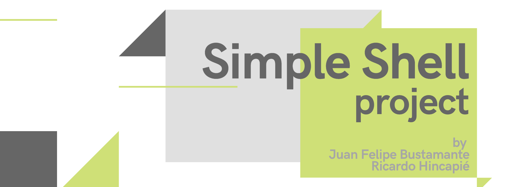

# Simple Shell Project
 This is a simple shell built in C language with basic functionality.

## Motivation
This project is made for learning purposes and because ***#CisFun***.

It is part of the **Unit 00 - Programming foundations** at [Holberton School](https://www.holbertonschool.com/pathway_foundations).

## Prerequisites
As this shell is built upon Ubuntu trusty 14.04 LTS, please use a compatible operating system.

### Installation

Clone the repository at: [Simple Shell Project](https://github.com/ricarhincapie/simple_shell.git)

Compile this way:

```
gcc -Wall -Werror -Wextra -pedantic *.c -o hsh
```

And then, inside the directory of compiling of using the absoulute path of it, do:
```
./hsh
```

## Running the tests
Explain how to run the automated tests for this system

Break down into end to end tests
Explain what these tests test and why

Give an example

### And coding style tests
[Holberton School coding style](https://github.com/holbertonschool/Betty/wiki), which is inspired and slightly modifies the [Linux kernel coding style](https://git.kernel.org/pub/scm/linux/kernel/git/torvalds/linux.git/plain/Documentation/process/coding-style.rst)

#### Indentation example

Tabs equals to 4 spaces:
```
sample_func(char suffix)
{
    int var;
    var = 0;
    switch (suffix)
    {
    case 'G':
    case 'g':
        var = 30;
        break;
     }
}
```
#### Lenght of lines
The limit on the length of lines is **80 columns** and this is a strongly preferred limit.

#### Lenght of functions
Functions should be short and sweet, and do just one thing.
They must fit on **40 lines**, and do one thing and do that well.

## Built With
Visual Basic Code
Ubuntu 14.04 LTS


## Contributing
Please, contact us if you are interested in continue this project. We would be excited to give you a short introduction to it.


## Authors
Ricardo Hincapie - Software Developer - [@RicarHincapie](https://www.linkedin.com/in/ricardohincapie/)

> :rocket: Let's follow each other on [Github](https://github.com/ricarhincapie)

Juan Felipe Bustamante - Software Developer - [@PipeBustamante](https://www.linkedin.com/in/pipebustamantem/)

> :rocket: Let's connect! [Github](https://github.com/jfbm74)

See also the list of contributors who participated in this project.

## License
This project is not licensed.

## Acknowledgments
To our families, for whom all the effort is worth it.

To the coding global community, for its efforts to keep knowledge available.
